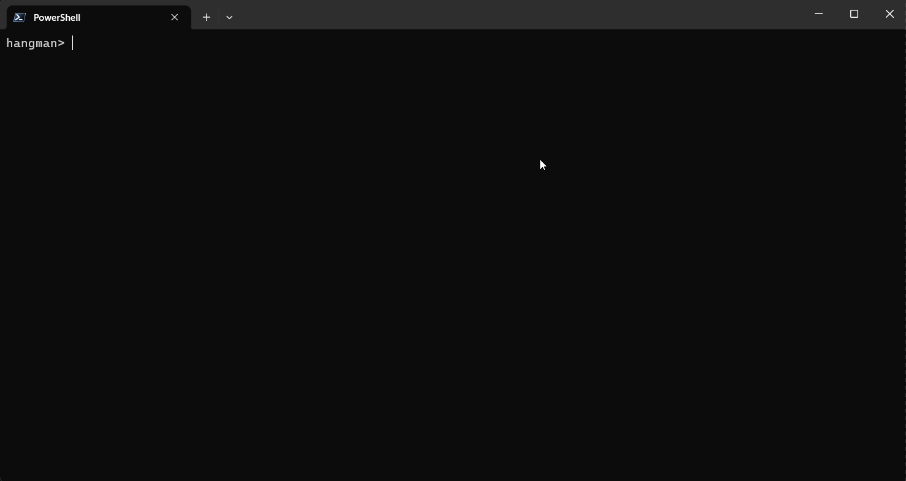

# Hangman



## How to run

Navigate to the project folder using the terminal and run:

```bash
python -m hangman
```

## Author

-   [Igor Ferreira](https://github.com/ig0r-ferreira)

## License

This project is under license from [MIT](LICENSE).
